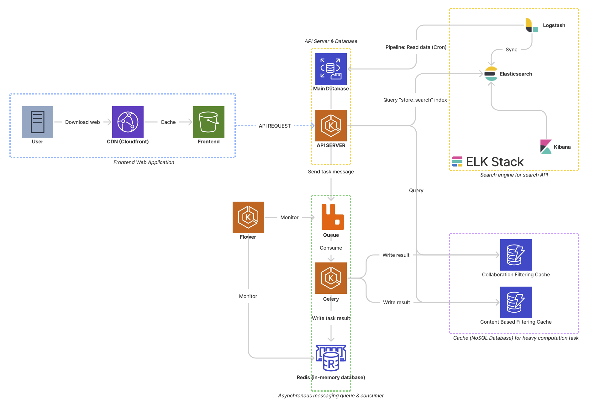

# Database & ELK Stack



## Prerequisite
- docker & docker-compose 

## Run on local machine
```bash
$ docker-compose up mysql
$ cd mysql-management
$ ./load_schema.py
$ ./load_data.py

$ docker-compose up elasticsearch

$ docker-compose up logstash kibana
```
